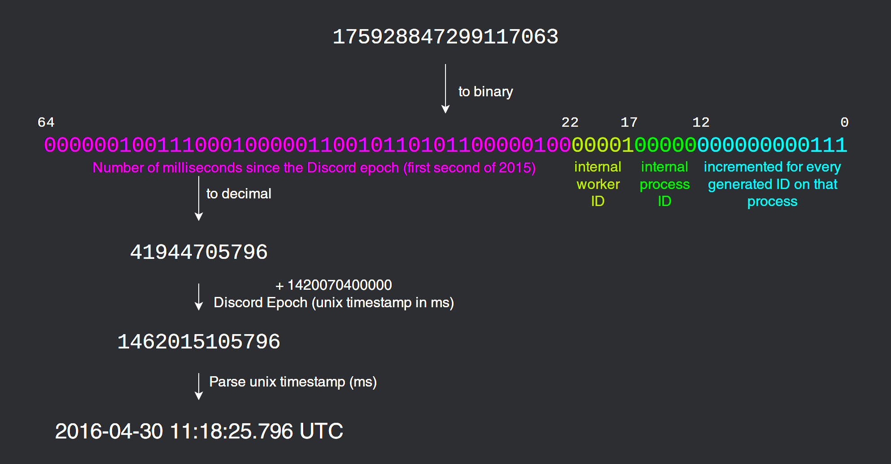

# snowflakey
> A lightweight Node.js snowflake generator/lookup tool

> [GitHub](https://www.github.com/PassTheWessel/Snowflakey) **|** [NPM](https://www.npmjs.com/package/snowflakey)

## Installing
```sh
$ yarn add snowflakey # Install w/ Yarn
$ npm i snowflakey # Install w/ NPM
```

## Usage
##### Using a worker
```js
// Declare snowflakey
const snowflakey = require('snowflakey');
// Create the worker instance
const Worker = new snowflakey.Worker({
  name: 'starling',
  epoch: 1420070400000,
  workerId: process.env.CLUSTER_ID || 31,
  processId: process.pid || undefined,
  workerBits: 8,
  processBits: 0,
  incrementBits: 14
});

// Generate the snowflake
const flake = Worker.generate();
console.log(`Created snowflake: ${flake}`);
console.log(`Creation date    : ${snowflakey.lookup(flake, worker.options.epoch)}`);
console.log(`Deconstructed    : ${Worker.deconstruct(flake).timestamp.valueOf()}`);
```

##### Using a master
```js
// ... Worker code
// Create the master instance and add the worker
const Master = new snowflakey.Master();
master.addWorker(Worker);
// Listen to the events
master.on('newSnowflake', (data) => {
  console.log(`created snowflake: ${data.snowflake} by Worker ${data.worker.options.name || data.worker.options.workerId}`)
  console.log(`Creation date    : ${Snowflake.lookup(flake, data.worker.options.epoch)}`);
  data.worker.deconstruct(data.snowflake);
});

master.on('deconstructedFlake', (data) => {
  console.log(`Deconstructed    : ${data.timestamp.valueOf()} by Worker ${data.worker.options.name || data.worker.options.workerId}`);
});
// Make the worker generate a snowflake
worker.generate();
```
##### Result
```sh
$ node test.js
Created snowflake: 534760094454759424
Creation date    : 2019-1-15 16:45:41
Deconstructed    : 1547567141880
```

### What is a snowflake?
Snowflakes are strings that range from 14 to 19 characters long that can give every user it's unique idea. You can't get much data with just a snowflake, but you can get the creation date of the snowflake and identify every unique user with it.
